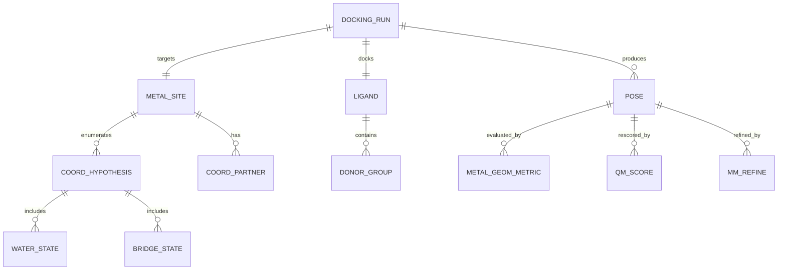

# Metal-Aware ε-Certified Docking for Chelated Ligands and Coordination Chemistry

## Executive summary

The user-provided document proposes a **“certified docking engine”** that returns (i) the best pose found and (ii) an **ε-optimality certificate**—a guarantee that no pose in the defined search space can beat the returned score by more than ε under the engine’s scoring function—implemented via **branch-and-bound over partitioned pose space** with conservative lower bounds and pruning. fileciteturn0file0L205-L245

Extending this premise to **metal-chelated ligands and coordination chemistry** is feasible, but only if the system explicitly models: (a) coordination geometry and variable coordination number, (b) polarization/partial covalency, and (c) water/ligand exchange—each of which is central to metalloprotein recognition and failure-prone in “standard” docking. Metalloprotein docking is widely recognized as difficult because of the **ligand–metal bond** and metal-specific interaction physics. citeturn13view3

A practical synthesis is a **two-mode engine**:  
(1) a **high-throughput** metal-aware docking mode (constraints + specialized potentials + ensemble/water hypotheses), and  
(2) a **high-assurance** ε-certified mode for *small sets* (lead optimization / debugging / audit), coupled to **multi-fidelity rescoring** (QM/MM or DFT for the metal region). This aligns with the document’s own feasibility analysis: certification is compelling but likely to struggle with **dimensionality and bound tightness** and should be used selectively. fileciteturn0file0L314-L375

Key refinements recommended here:
- Treat “metal chemistry” as **discrete hypotheses** (metal identity/oxidation/spin; coordination number; water occupancy; bridging) followed by per-hypothesis docking/certification, because coordination environments vary widely across metals and sites. citeturn12view3turn15view2turn15view3  
- Add a **metal-aware scoring layer** with **directional, geometry-sensitive terms** (distance + angle), building on proven strategies such as AutoDock4Zn’s directional zinc model and geometry-driven zinc docking. citeturn12view0turn13view4  
- Make **QM/MM rescoring** a first-class stage for metal-involving candidates because many decisive effects (polarization, charge transfer, redox/spin sensitivity) are intrinsically quantum; modern QM/MM docking benchmarks show particular gains for metal-binding complexes when the metal and coordinating residues are included in the QM region. citeturn17view1turn18view0  
- Enforce **metal geometry validity checks** (coordination number/geometry, missing waters) using established community concepts/tools (e.g., FindGeo; wwPDB metalloprotein remediation). citeturn16view0turn16view1

## Premise, scope, and feasibility implications for metal chemistry

The core novelty is an engine that **certifies near-optimality under its own score** by bounding and pruning search regions rather than relying purely on stochastic sampling. fileciteturn0file0L205-L245 A central caveat is that even perfect ε-optimality under an approximate score does **not** guarantee physical correctness or true binding free energy, so the certified result must be paired with physics/validity checks and higher-fidelity rescoring. fileciteturn0file0L329-L375

For metalloproteins and metal-chelated ligands, feasibility depends strongly on open variables the user flagged (metal types, targets, throughput vs accuracy). Two metal-driven considerations cut both ways:

Metal coordination can reduce the continuous search space.  
Coordination imposes strong geometric constraints (preferred distances/angles/coordination numbers). If the engine elevates coordination to **explicit constraints or templated “coordination slots”**, it can (a) focus sampling and (b) tighten bounds—helpful for branch-and-bound pruning. Geometry-driven sampling specific to zinc proteins (e.g., using discovered coordination motifs) is an existence proof that encoding coordination geometry can improve pose generation. citeturn13view4

Metal physics can also make bounds harder.  
Realistic metal–ligand interactions include directionality, polarization, partial covalency, ligand exchange, and sometimes redox/spin-state sensitivity—phenomena that are difficult to represent with smooth, cheap, globally boundable scoring terms. Metal sites also often include coordinating waters or bridging ligands. citeturn15view1turn15view3turn19view0

A workable compromise is to **keep the certified layer boundable** (e.g., using piecewise-smooth distance/angle penalties and grid terms) while deferring the most quantum-sensitive effects to a **post-certification refinement** stage (QM/MM or DFT) and/or to a separate “physics validity gate,” consistent with the document’s recommended multi-fidelity funnel. fileciteturn0file0L354-L375

## Metal coordination chemistry requirements that must be modeled

A major design constraint is that biologically common metals span different preferred geometries, donor preferences, coordination-number distributions, and electronic behaviors. Large structural surveys and curated databases emphasize the **variety of coordination numbers, donor types, and distortions from ideal geometry**, as well as the frequent presence of waters or small molecules in the coordination sphere. citeturn15view1turn16view1turn12view3

### Practical metal “classes” for docking design

Transition metals (Zn, Fe, Cu, Co, Ni, Mn).  
Preferred geometries differ: analyses of metalloprotein structures report **octahedral preference for Co²⁺/Ni²⁺**, **tetrahedral preference for Zn²⁺**, and **square planar preference for Cu²⁺** (with caveats by environment). citeturn15view0turn15view2  
These metals often exhibit **partial covalency, charge transfer, and redox sensitivity** (especially Fe and Cu), motivating QM/MM treatment when accuracy matters. citeturn15view4turn18view0turn15view2

Main-group hard cations (Mg²⁺, Ca²⁺).  
Coordination is typically oxygen-donor dominated with coordination numbers often around 5–6 in proteins, supporting models emphasizing hard-sphere + polarization effects and explicit water/hydration treatment. citeturn15view2turn15view4

Lanthanides (Ln³⁺; “rare earths”).  
Ln³⁺ commonly prefer **high coordination numbers (CN ~ 8–10)** with hard Lewis bases and frequently retain coordinated waters when the protein/ligand cannot saturate coordination. citeturn15view3turn15view4 This implies that **water displacement hypotheses** and **high-CN template libraries** are essential for Ln-bearing targets.

### Coordination variability and electronic effects that drive failure in docking

Variable coordination number and ligand exchange.  
Catalytic metal sites often undergo ligand exchange (water ↔ substrate/inhibitor), which bonded-only representations can miss. Dummy-atom models were developed partly to enable geometry enforcement while allowing exchange. citeturn12view2turn19view0

Partial covalency and polarization.  
A key limitation of simple electrostatics + 12–6 LJ metal models is that they neglect ion-induced dipole interactions and other polarization effects; extended models (e.g., 12–6–4 LJ) were introduced to address this. citeturn12view2turn14view0  
Dummy-atom formulations also explicitly interpret coordination bonds as partly covalent/partly electrostatic, improving qualitative realism for some sites. citeturn12view2

Redox/spin sensitivity.  
Reviews of QM/MM for metal-binding proteins emphasize that transition-metal sites require explicit electronic treatment to represent redox intermediates and metal-driven chemistry correctly. citeturn18view0turn15view4

image_group{"layout":"carousel","aspect_ratio":"16:9","query":["tetrahedral zinc coordination geometry diagram metalloprotein","octahedral magnesium coordination geometry diagram","square planar copper(II) coordination geometry diagram","lanthanide coordination number 9 complex structure diagram"],"num_per_query":1}

## Methods landscape and comparison tables for metal-aware docking

Metal-aware docking is best designed as a **workflow** rather than a single “magic” score, because (i) fast docking scores can be made metal-sensitive but remain approximate, and (ii) high-fidelity electronic structure is too expensive for large libraries. This is reflected both in the certified-docking document’s multi-fidelity notion fileciteturn0file0L354-L375 and in modern metalloprotein docking literature emphasizing limitations of classical docking for metal-coordination/polarization. citeturn13view3turn17view1

### Table of metal-site interaction models for parameterization and refinement

| Model family | What it captures well | Typical misses / risks | Best use in the proposed pipeline | Primary sources |
|---|---|---|---|---|
| **Simple nonbonded ion** (point charge + 12–6 LJ) | Speed; easy integration with MM/docking-like scores | Poor polarization/charge transfer; can distort coordination distances/geometry for highly charged ions | Only as a coarse baseline or when metal is distant from docking pharmacophore | Limitations and need for improved terms discussed in 12–6–4/dummy model literature citeturn12view2turn14view0 |
| **12–6–4 LJ nonbonded** | Adds ion-induced dipole term; improved hydration free energies and ion–oxygen distances for highly charged ions | Still classical; may be insufficient for strongly covalent metal–thiolate or redox/spin issues | Refinement MD and “physics plausibility” gate; useful for many divalent/trivalent ions | 12–6–4 parametrization and motivation citeturn14view0turn12view2 |
| **Cationic dummy-atom models** | Enforces coordination geometry while allowing ligand exchange; distributes charge; useful for multinuclear sites | Requires topology choices (geometry frames); may struggle across changing CN environments without careful design | Refinement MD for catalytic sites; also informs docking constraints/templates | Dummy model concept and 12–6–4 extension citeturn12view2turn19view0 |
| **Bonded metal-site models** (bond/angle/dihedral + charges) | Stable structural metal sites; preserves a chosen coordination geometry | Poor for ligand exchange; transferability limited; system-specific | Refinement MD for structural sites; fixed coordination in later-stage scoring | ZAFF/MCPB approach and limitations of predefined bonds citeturn13view1turn12view2 |
| **MCPB.py bonded parameterization toolchain** | Practical bridge from QM to MM parameters; supports many ions; standardizes workflows | Requires QM setup choices; still inherits classical limitations | Parameterization backend for MD refinement; generating site parameters for validation simulations | MCPB.py capabilities (bonded model; >80 metal ions) citeturn13view0 |
| **ZAFF / zinc-focused bonded libraries** | Convenience for common Zn coordination environments; supports Zn site stability for MD | Zinc-focused; geometry “locked” by construction | Zn-containing targets where CN is known and stable (e.g., structural Zn) | ZAFF creation and intended use citeturn13view1 |
| **QM/MM** (semiempirical → DFT) | Polarization/charge transfer; metal-specific effects; can improve docking for metal-binding ligands | Computational cost; convergence issues; sensitive to structure quality and QM region definition | Rescoring/refinement for top poses; calibration of metal-aware scoring terms | QM/MM importance for metal electronic effects citeturn18view0turn17view1 |
| **DFT (cluster or QM region)** | Best local electronic fidelity among practical options; can resolve geometry/charge states | Functional dependence; expensive; limited throughput | Reference calculations for parameterization and scoring calibration; final adjudication | DFT challenges for transition metals noted in QM/MM reviews citeturn18view0turn18view1 |

### Table of docking and scoring approaches that explicitly address metals

| Approach / program class | Metal handling mechanism (relevant to chelation/coordination) | Evidence of utility | Fit to ε-certified premise |
|---|---|---|---|
| AutoDock4Zn-style directional potentials | Adds **directional, charge-independent** Zn-specific coordination terms calibrated on metalloprotein complexes | Designed for efficient docking while encoding metal geometry/strength tradeoffs citeturn12view0 | Good candidate for the *boundable* (fast) scoring layer; directional terms can be designed to admit conservative bounds |
| Metalloprotein bias docking (MBD) | Knowledge-driven docking biases to better mimic metal–ligand bonding; built on AutoDock Bias | Reported improvements in pose prediction accuracy/precision vs conventional docking across multiple metals (Ca, Co, Fe, Mg, Mn, Zn) citeturn13view3 | Strong as a “prior/heuristic upper bound initializer” to accelerate certification (better initial UB improves pruning) fileciteturn0file0L345-L352 |
| Geometry-matching sampling for Zn (GM-DockZn) | Samples ligand conformations on grids around ideal coordination positions from discovered motifs | Reported best near-native sampling for correct coordination atoms/numbers; combining with a separate ranker can improve top-1 success citeturn13view4 | Particularly compatible with certification because geometric constraints reduce search volume; suggests discrete “motif hypotheses” |
| Open-access docking for metal complexes (MetalDock) | Integrates AutoDock with QM packages; automates metal–organic complex docking; learns missing LJ parameters for metal atom types | Addresses metallodrug docking scarcity; claims generalization of derived LJ params citeturn16view2 | Relevant when the *ligand itself contains a metal*; certification must treat internal metal coordination as rigid (or specialized) degrees of freedom |
| Classical docking benchmarks on metalloproteins (noncommercial tools) | Diverse engines with varying implicit/explicit metal handling | In a metalloprotein benchmark (213 complexes), pose success differed widely; PLANTS/LeDock/QVina/Vina stronger than AutoDock4 and DOCK6 for posing; ranking/affinity remains challenging citeturn12view4 | Reinforces need for hybrid/cascaded workflows and metal-aware scoring/validation rather than single-score reliance |
| DL metalloprotein-specific docking (MetalloDock, 2026) | DL docking framework intended to capture metal-ligand interactions more reliably than conventional docking/DL baselines | Framed explicitly around metalloprotein interaction gaps in conventional tools citeturn17view0 | Could serve as a fast proposal generator (upper bound seeding) but still needs physics/validity and careful generalization testing |

## Failure modes as a structured risk register with mitigations

Metalloproteins amplify standard docking failure modes because the “interaction of interest” is often a **coordination bond**, not a typical hydrogen bond or hydrophobic contact. citeturn13view3turn15view2 The certified-docking premise adds its own algorithmic risks (bound looseness, dimensionality, discontinuities, flexibility). fileciteturn0file0L314-L330

### Failure-mode table mapping causes to mitigations

| Failure mode | Root cause | What it breaks | Mitigation (engineering + protocol) | Key supports |
|---|---|---|---|---|
| Wrong metal identity / oxidation state / missing cofactors | PDB/model ambiguity; substitutions; missing ions/waters | Coordination geometry, electrostatics, redox-sensitive binding | Enforce metal-site remediation: detect/validate coordination partners + geometry; log assumptions per hypothesis | wwPDB remediation and FindGeo rationale citeturn16view0turn16view1 |
| Incorrect coordination number (CN) or geometry target | Metal/site-dependent variability (CN distributions differ by metal and environment) | Pose plausibility; donor selection; scoring | Treat CN/geometry as hypothesis set (e.g., CN=4/5/6 for Zn; CN=8–10 for Ln³⁺); run docking per hypothesis; penalize deviations | CN/geometry distributions in structural analyses citeturn15view2turn15view3turn15view0 |
| Mis-modeled chelator protonation state | Chelating groups (e.g., hydroxamates/thiols/carboxylates) can switch protonation upon binding | Donor availability; metal–ligand bond strength; ranking | Enumerate protomers/tautomers + metal-bound forms; re-score with QM/MM for top poses; validate with experimental pH/competition | Metal-binding requires specialized tools/data; QM/MM relevance citeturn13view3turn18view0turn17view1 |
| Water displacement mishandled | Coordinated waters often complete CN; binding may displace or retain them | False poses; wrong enthalpy/entropy balance | Explicit “water occupancy states” in docking; include waters as discrete variables; use geometry tools to flag “missing water” cases | Coordinated waters common; FindGeo supports missing-ligand geometries citeturn15view1turn16view1turn15view3 |
| Bridging ligands / multinuclear sites mishandled | Binuclear sites (e.g., Zn–Zn) need correct bridging (OH⁻/H₂O/ligand) | Donor assignment; geometry; binding mode | Add multinuclear templates; include bridging ligand states; consider dummy-atom or QM/MM refinement for finalists | Binuclear Zn + bridging hydroxide example citeturn19view0turn12view2 |
| Classical score cannot capture polarization/charge transfer | Metal–thiolate and similar bonds have strong covalency/charge transfer | Ranking, and sometimes pose | Make QM/MM rescoring mandatory for metal-contacting poses; or include polarization-inspired terms/dummy models in refinement | Charge transfer notes in metal-distance surveys and QM/MM reviews citeturn15view2turn18view0turn12view2 |
| Parameterization mismatch (ligand vs protein metal site) | Mixed toolchains; inconsistent charge/VDW conventions | Refinement instability; misleading rescoring | Standardize parameterization: MCPB.py for bonded sites; 12–6–4 or dummy models for exchangeable sites; document provenance | MCPB.py design and 12–6–4 motivations citeturn13view0turn14view0turn12view2 |
| ε-certified search fails to prune (intractable) | Loose lower bounds; high torsional dimensionality | Run-time blowup; unusable “certified” mode | Constrain search using coordination templates; correlated bounds; good UB initialization; multi-fidelity safe bounds; certify per discrete hypothesis | Certified docking failure modes + repairs fileciteturn0file0L316-L375 |
| Certified optimum is “wrong” physically | Score model mismatch to real chemistry | False confidence | Report: “ε-optimal under score” separately from “passed chemistry/physics validity + QM/MM refinement”; require validity gates | Document’s “certificate-under-score” caution fileciteturn0file0L369-L375 |

## Recommended workflows with parameterization steps and design refinements

A robust practical workflow should combine (i) **metal-site hypothesis management**, (ii) **fast metal-aware docking**, (iii) **certification as an optional audit mode**, (iv) **QM/MM rescoring**, and (v) **geometry/chemistry validity gates**, consistent with both metalloprotein docking literature and the certified-docking document’s funnel strategy. citeturn13view3turn17view1turn16view1 fileciteturn0file0L354-L375

```mermaid
flowchart TD
  A[Input: receptor structure + metal site(s) + ligand library] --> B[Metal-site remediation & hypothesis enumeration]
  B --> C{Hypotheses per site}
  C --> C1[Metal identity / oxidation / spin (if relevant)]
  C --> C2[Coordination number & geometry templates]
  C --> C3[Water / bridging ligand occupancy states]
  C --> D[Fast metal-aware docking per hypothesis]
  D --> E[Pose clustering + metal-geometry validity gating]
  E --> F{Mode}
  F -->|High-throughput| G[Consensus scoring + triage]
  F -->|High-assurance| H[ε-certified search on reduced space]
  H --> I[Top poses per hypothesis]
  G --> I
  I --> J[QM/MM rescoring (semiempirical -> DFT on finalists)]
  J --> K[MD refinement with chosen metal force-field model]
  K --> L[Output: poses + uncertainty + provenance]
```

### Workflow details and parameterization steps

Metal-site remediation and hypothesis enumeration (mandatory).  
Use explicit coordination analysis to (a) identify coordinating atoms, (b) assign coordination geometry/CN, and (c) detect “missing ligand” cases such as absent waters—an issue FindGeo explicitly targets, and which is also embedded in wwPDB metalloprotein remediation practices. citeturn16view1turn16view0  
This step should create a small set of discrete hypotheses per site (CN/geometry; water occupancy; bridging for multinuclear sites), reflecting observed structural diversity. citeturn15view2turn15view3turn19view0

Fast metal-aware docking (screening stage).  
Choose one or more of:
- Directional geometry-sensitive potentials for Zn-like sites (AutoDock4Zn-style) when Zn coordination dominates recognition. citeturn12view0  
- Bias/knowledge priors (MBD) when known interaction motifs exist to seed correct coordination. citeturn13view3  
- Geometry-driven sampling (GM-DockZn-like) when the key failure is finding correct coordinating atom sets and CN. citeturn13view4  
Benchmarks show that metalloprotein docking success varies substantially with the engine; thus, protocol-level consensus is often more reliable than a single tool. citeturn12view4

ε-certified search (optional “audit/lead” mode).  
Implement certification only after reducing search complexity using coordination constraints/templates; otherwise the branch-and-bound approach risks intractability from torsional dimensionality and loose bounds, exactly as flagged in the source document. fileciteturn0file0L316-L343  
Critically, the certified mode should be framed as: “ε-optimal under the docking score for a defined hypothesis,” not “physically correct.” fileciteturn0file0L369-L375

Metal-aware parameterization for refinement (MD / energetic plausibility).  
Select the force-field model by site type:
- Structural, fixed-geometry metal sites (e.g., many Zn structural motifs): bonded models using established parameter libraries or MCPB-derived parameters (ZAFF lineage). citeturn13view1turn13view0  
- Catalytic/exchangeable metal sites: dummy-atom approaches (enable exchange while preserving geometry) and/or 12–6–4 LJ for improved polarization behavior. citeturn12view2turn14view0  
For chelator-specific tuning (especially when chelation energetics matter), chelator-based 12–6–4 parameter tuning methods exist and were tested on EDTA/NTA/EGTA and protein loop chelators, improving binding energies and coordination statistics. citeturn13view2

QM/MM rescoring (accuracy-critical stage).  
QM/MM is the most defensible way to capture polarization and metal-specific electronic effects; reviews emphasize its importance for metal-binding proteins. citeturn18view0  
Recent QM/MM docking results indicate that including the **metal and coordinating side chains** in the QM region can substantially improve success for metal-binding complexes; semiempirical QM/MM can be robust and moderately priced, while DFT-level refinement can further improve but may face convergence/cost issues. citeturn17view1

### Minimal internal data model for an implementable “metal module”



## Validation protocols, benchmarks, experimental suggestions, and prioritized action items

### Computational validation and benchmarks

Dataset construction should be metal-aware and hypothesis-aware.  
Large curated datasets exist for metal sites and their geometries (e.g., MetalPDB provides statistics and coordination-geometry distributions; FindGeo classifies geometries by template matching). citeturn12view3turn16view1  
For docking evaluation, the metalloprotein subset benchmark compiled from PDBbind refined (213 nonredundant metalloprotein complexes) is a direct precedent for assessing posing/scoring power across engines and should be mirrored for your chosen metals and target families. citeturn12view4

Pose metrics must include coordination correctness, not RMSD alone.  
For metal-chelated ligands, include:
- correct coordinating atom identities (donor selection),
- coordination number and geometry class (e.g., tetrahedral vs trigonal bipyramidal vs octahedral),
- metal–donor distance distributions,
- water/bridge occupancy consistency.  
These are explicitly treated as meaningful descriptors in metal-site structural databases and coordination surveys. citeturn12view3turn15view2turn16view1

Ablations aligned to the certified premise.  
To validate the ε-certified layer specifically, measure:
- pruning efficiency vs ε for representative ligand flexibility classes, consistent with the document’s warning about torsional dimensionality and bounds. fileciteturn0file0L316-L343  
- agreement between certified optimum under fast score and the best pose after QM/MM rescoring, to quantify “score realism.” citeturn17view1turn18view0  
- sensitivity to discrete hypotheses (CN/geometry/water), as a proxy for uncertainty when metal state is ambiguous. citeturn15view2turn15view3

### Experimental validation suggestions (especially diagnostic for metal coordination)

Structural validation (direct geometry confirmation).  
X-ray crystallography or cryo-EM structures of ligand-bound complexes directly validate coordination geometry and water displacement, which are central to metalloprotein specificity. citeturn15view1turn16view0

Spectroscopy chosen by metal/electronic state.  
QM/MM reviews emphasize that spectroscopy + computation is powerful for assigning metal states and intermediates, especially when redox/spin effects matter. citeturn18view0  
Practical pairings include EPR (paramagnetic centers), Mössbauer (Fe), XAS/EXAFS (metal–ligand distances), and competition assays for binding stoichiometry; selection depends on which metals you prioritize. citeturn18view0turn15view4

Metal-competition and chelation thermodynamics.  
Because stability/selectivity across divalent transition metals follows broad trends (e.g., Irving–Williams) and can complicate selective chelation, competition experiments help validate whether modeled selectivity is plausible. citeturn15view4

### Prioritized action items for refinement and validation

1. **Define metal scope + hypothesis policy**: decide which metals (Zn/Fe/Cu/Mg/Mn/Ni/Co/Ca/Ln) are “first-class,” and whether redox/spin are modeled explicitly or treated as discrete fixed states. Ground this in coordination statistics and donor preferences for each metal class. citeturn15view2turn15view3turn15view4  

2. **Implement metal-site remediation + geometry classification** as a mandatory preprocessing stage (coordination partners, CN/geometry, missing waters), following community practice and tooling concepts. citeturn16view0turn16view1  

3. **Add a metal-aware scoring layer that is (a) geometry-sensitive and (b) boundable** for certification: distance/angle potentials per metal and donor type, and explicit penalties for CN/geometry violations. Use Zn as the pilot case (directional potentials and/or motif-based sampling have strong precedent). citeturn12view0turn13view4  

4. **Tightly couple “coordination templates” to the certified search space** to improve pruning (reduce DOF, tighten lower bounds), consistent with the document’s recommended repair strategy emphasizing correlated bounds and selective certification. fileciteturn0file0L334-L375  

5. **Standardize parameterization for refinement** via a documented decision tree: MCPB.py/ZAFF-like bonded models for stable structural sites; dummy/12–6–4 models for exchangeable/catalytic sites; chelator-tuned 12–6–4 for chelation energy fidelity where needed. citeturn13view0turn13view1turn13view2turn12view2turn14view0  

6. **Make QM/MM rescoring non-optional for metal-contacting poses** in the accuracy workflow, with explicit rules for QM region definition (metal + first-shell ligands at minimum), reflecting demonstrated performance sensitivity to QM-region choice. citeturn17view1turn18view0  

7. **Build a metalloprotein benchmark mirroring real use cases**: start from the known nonredundant metalloprotein subset approach (PDBbind-derived) and extend with your target families and metals; evaluate pose geometry correctness (not only RMSD) and report uncertainty across hypotheses. citeturn12view4turn12view3turn15view2