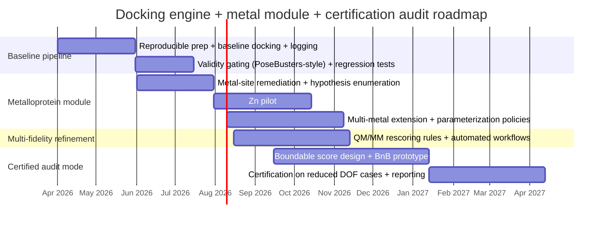

# Deep research report on the attached novel docking plan and PDF-ready visualization stack

## Executive summary

The attached documents articulate two complementary “build paths” for a new molecular docking engine: a conventional, production-oriented engine (fast search + approximate scoring + refinement) and a novel **ε-certified docking mode** that returns a pose plus an explicit near-optimality gap certificate under the engine’s scoring function (via branch-and-bound over partitioned pose space). fileciteturn0file1 fileciteturn0file0L205-L245 The certified concept is genuinely differentiated—formal guarantees are not typical in mainstream dockers like AutoDock Vina or AutoDock4. citeturn7search4turn7search1

The same documents correctly anticipate the two core realities that will determine success: (1) **global certification is only as meaningful as the score being certified**, and (2) certification is likely to be **computationally hard in high-dimensional pose spaces** unless the search space is aggressively reduced and bounds are tight. fileciteturn0file0L314-L375 citeturn12search9 These risks become sharper for **metalloproteins** because correct binding geometry often depends on coordination number/geometry, water/ligand exchange, and metal-specific physics, which are difficult to represent with cheap, globally “boundable” scoring terms. citeturn9search6turn9search1turn11search9

The strongest overall strategy is therefore a staged program:  
Build a robust baseline docking pipeline first (so you can ship value and benchmark continuously), then add (a) a metal-aware “hypothesis + constraints” layer and (b) an ε-certified **audit** mode applied selectively (lead optimization, debugging, method evaluation). This sequencing aligns with the reality that (i) hybrid pipelines are increasingly necessary to get both plausible poses and useful ranking, and (ii) modern DL pose generators can accelerate proposal generation but require physics/plausibility checks. citeturn8search7turn8search2turn8search1

For the requested PDF-visualization component, the high-level guidance is consistent across major publishers and accessibility standards: prefer vector formats (PDF/SVG/EPS) for line art and plots, keep fonts and line weights readable at final size, respect resolution expectations for raster imagery, and produce accessible PDFs with tags and alt text (PDF/UA + WCAG techniques). citeturn1search4turn1search8turn1search1turn0search1turn1search3turn0search4turn0search12 A practical toolchain for publication-quality figures typically combines a plotting system (Matplotlib/ggplot2/PGFPlots or an interactive grammar like Plotly/Altair), a vector editor (Inkscape/Illustrator/Affinity), and (for 3D) a renderer/visualizer (Blender/ParaView/PyVista), with explicitly defined export presets for print and screen. citeturn4search6turn4search3turn2search6turn2search11turn16view0turn3search5turn3search1turn24view0turn3search9

## Assessment of the attached novel process plan and its implications

The “novel” core of the attached plan is the **ε-certified docking engine** concept: rather than returning “the best pose we found,” it returns the best pose plus a certificate that no pose in the defined search space can beat it by more than ε *under the implemented score*, using partitioning + conservative lower bounds + pruning (branch-and-bound). fileciteturn0file0L205-L245 This framing is scientifically valuable because it makes uncertainty under the scoring model explicit and turns docking into a verifiable optimization service.

The plan is also notably self-critical in the right places: it highlights that certification can fail in practice due to dimensionality (6 rigid-body DOF + many torsions), loose bounds, discontinuous terms, and receptor flexibility; and it emphasizes selective use and multi-fidelity funnels rather than “certify everything.” fileciteturn0file0L314-L375 These concerns are consistent with the standard branch-and-bound requirement that progress depends on computing meaningful lower and upper bounds over subregions. citeturn12search9

On the metalloprotein side, the plan’s recommendations match what the literature shows are the most reliable “metal-aware” levers:

- **Geometry-aware metal terms**: AutoDock4Zn explicitly adds energetic + geometric components for zinc coordination and was calibrated on a large zinc-complex set. citeturn9search6  
- **Knowledge-driven biasing**: Metalloprotein bias docking (MBD) extends AutoDock Bias to reproduce metal–ligand interactions and reports improved docking outcomes across multiple metals and families. citeturn9search5turn9search1  
- **Geometry-constrained sampling**: GM-DockZn samples ligand conformations around ideal coordination positions derived from zinc coordination motifs. citeturn9search7  
- **Geometry validation/remediation**: FindGeo provides coordination-geometry classification for structured validation, and the wwPDB is actively remediating metalloprotein entries to improve coordination annotation and chemical description. citeturn10search2turn10search19  
- **Parameterization + refinement**: MCPB.py supports bonded-model metal center parameters (including “more than 80 metal ions”), and the 12–6–4 Lennard-Jones family explicitly addresses ion-induced dipole interactions missing from simpler 12–6 models. citeturn10search0turn10search17turn10search5  
- **QM/MM as a decisive stage**: a recent hybrid QM/MM docking benchmark reports that QM/MM docking is especially advantageous for metal-binding complexes, even with relatively fast semi-empirical levels (PM7). citeturn11search9  

Two key “process gaps” are worth tightening, because they affect both engineering feasibility and scientific credibility:

First, the plan needs a more operational definition of **what score is being certified**, and how that score relates to “physics plausibility.” The PoseBusters work demonstrates why this matters: modern DL docking methods can produce poses that fail physical plausibility or generalization checks, and evaluation must go beyond RMSD-only reporting. citeturn8search7

Second, metalloprotein docking needs explicit treatment of **discrete hypotheses** (metal identity/oxidation, coordination number/geometry, and water/bridging states) because either missing or mis-modeled coordination partners can dominate pose correctness. FindGeo and wwPDB metalloprotein remediation both underscore coordination geometry as a first-class structural feature. citeturn10search2turn10search3turn10search19

## Candidate approaches to pursue and comparative evaluation

The “best” approach depends on whether your primary optimization goal is (a) time-to-working-system, (b) novelty/publication, (c) metalloprotein correctness, or (d) verifiability. The most robust program is usually not a single approach but a sequence that de-risks the hardest parts.

The table below compares five candidate approaches that map cleanly onto your attached plan and the current state of the field.

| Candidate approach | What you build (scope) | Pros | Cons / risks | Resource needs (typical) | Likely outcomes if executed well |
|---|---|---|---|---|---|
| Pipeline-first integration around existing engines | A reproducible orchestration layer that combines proven docking engines + metal-aware variants + validity checks + rescoring | Fastest path to baseline performance; immediate benchmarking; leverages validated engines (Vina, AutoDock4, AutoDock4Zn, MBD, GNINA) citeturn7search4turn7search1turn9search6turn9search5turn7search11 | Less “novel engine” credit; integration complexity; toolchain brittleness across formats | 1–2 software engineers + 1 computational chemist; moderate compute | A working, publishable pipeline; strong empirical evidence about what fails where; a platform for later certified research |
| Conventional “new engine” baseline (Vina/smina-style) | A fast grid/field score + stochastic multi-start search + local optimization; Python API; extensible scoring hooks | Production-grade foundation; tunable speed/quality; aligns with widely used baselines citeturn7search4turn8search4turn4search6 | Hard to beat mature baselines without lots of evaluation; scoring remains approximate; protein flexibility remains difficult citeturn7search4turn7search1 | 2–4 engineers + 1 chemist; sustained compute for regression/CI tests | A reusable engine/library + strong internal benchmarks; supports later metal module and certification experiments |
| Metal-aware specialization module (constraints + hypotheses) | A metal-site model layer: coordination geometry templates, water/bridge hypotheses, directional score terms, geometry validity gates | Directly targets the metalloprotein failure modes; leverages proven ideas (AutoDock4Zn, MBD, GM-DockZn, FindGeo) citeturn9search6turn9search5turn9search7turn10search2 | Parameterization burden; site heterogeneity across metals; risk of overfitting to Zn-like sites | 1–2 engineers + 1–2 chemists; access to curated metalloprotein test sets | Improved pose correctness for metal-binding ligands; clearer failure attribution; solid foundation for selective certification on reduced spaces |
| Hybrid DL proposer + physics refinement + validity gating | Use DiffDock/DynamicBind/MetalloDock-like pose proposals; re-minimize and gate with physical/chemical tests; optional metal-aware rescoring | Very fast pose proposal; can address apo→holo changes (DynamicBind); can be metal-focused (MetalloDock) citeturn8search1turn8search2turn9search8 | DL generalization/validity risks; still needs force-field/QM checks; training data leakage issues are real in docking datasets citeturn8search7turn26search14 | 1–2 ML engineers + 1 chemist; GPU resources | Faster pipelines with comparable pose rates; if carefully validated, improves throughput for difficult targets and supports better upper bounds for certification |
| ε-certified “audit mode” (selective certification) | Branch-and-bound certification for reduced, boundable scoring functions; certify *after* proposal generation and DOF reduction | Distinct novelty: provable ε gap under score; improves reproducibility; valuable for debugging and method interpretation fileciteturn0file0L205-L245 | High risk of intractability unless bounds are tight; certificate can create false confidence if score is wrong; receptor flexibility complicates guarantees fileciteturn0file0L314-L375 | 1 optimization researcher + 1 engineer; substantial algorithmic R&D | A credible research artifact if constrained and honestly scoped; strong tool for lead-optimization and “why did it choose this pose?” explanations |

A synthesis recommendation, consistent with both your documents and current best evidence, is:

- Use **Pipeline-first integration** to establish a continuously tested baseline and avoid months of “engine-building without feedback.” citeturn7search4turn8search4turn8search7  
- Build a **conventional core** (or fork/extend an extensible baseline like smina) only once you have stable benchmarks and a clear performance target. citeturn8search4turn8search0  
- Treat **metal-awareness as a hypothesis-management and constraints problem first**, then as a scoring problem; anchor Zn as the pilot because of the maturity of directional Zn models and Zn-focused docking literature. citeturn9search6turn9search7  
- Run **ε-certification as an audit stage**, not as the default docking mode; use it where it creates clear value: lead optimization, debugging, regression testing, and method comparison under a fixed score. fileciteturn0file0L314-L375  
- If you adopt DL proposal models, embed **PoseBusters-like validity gating** (and, for metalloproteins, explicit coordination validity checks) into the output contract. citeturn8search7turn10search2

## Roadmap, benchmarking design, and risk controls

A practical way to keep both novelty and feasibility is to structure the work so that each phase can be evaluated on real benchmarks, with explicit “definition of done” metrics. PDBbind remains a central binding-affinity/complex dataset (and continues to publish updated release counts), and CASF-2016 provides a widely used scoring-function benchmark design. citeturn26search7turn26search4turn26search5 For DL docking/scoring work, CrossDocked2020 is a major dataset family, and GNINA’s more recent releases explicitly retrain models on updated CrossDocked2020 variants. citeturn26search6turn7search7turn26search17

A roadmap that matches the risk profile of certification and metalloprotein complexity is:



Key benchmarking and reporting controls:

- Keep “**ε-optimal under score**” separate from “**chemically/physically valid**.” This is explicitly motivated by the risk that high-scoring poses can be implausible, particularly for DL proposal engines without physics constraints. citeturn8search7  
- For metalloproteins, track metrics beyond RMSD: coordination atom identity correctness, coordination number/geometry match, metal–donor distances, and water/bridge occupancy correctness, because these define the chemistry of binding. citeturn10search2turn9search6turn9search7turn10search19  
- Make QM/MM rescoring an explicit stage for finalists when the ligand directly coordinates the metal; recent QM/MM docking evidence supports disproportionate benefit in metal-binding complexes. citeturn11search9  
- Adopt “leakage-aware” dataset splits when training or evaluating learned components; leakage control in PDBbind-derived settings is now a recognized issue. citeturn26search14  
- Use branch-and-bound only where you can justify conservative bounds; the method’s effectiveness depends on lower/upper bounding and pruning. citeturn12search9

## Best methods to portray data in a PDF

### Choosing chart and figure types by data type

Effective PDF figures are, fundamentally, about perceptual accuracy and truthful uncertainty representation. Cleveland & McGill’s graphical perception work supports prioritizing encodings like **position and length** over **angle and area** when accurate quantitative reading matters. citeturn13search1turn13search4 Separately, “Ten Simple Rules for Better Figures” is a practical, peer-reviewed checklist for figure clarity, consistency, and narrative. citeturn13search0

A pragmatic mapping for common data types:

| Data type / analytic goal | Recommended figure types in PDFs | Notes on “why” and common pitfalls |
|---|---|---|
| Time series, trajectories | Line charts; small multiples; uncertainty ribbons; horizon/sparklines only when space constrained | Line charts support position-based reading and are common for time series. citeturn13search1turn13search0 Avoid overplotting: prefer faceting or transparency. citeturn13search0 |
| Distributions (small–medium n) | Dot/strip plots with jitter; box plots + points; violin plots + points | Bar/line summaries can hide distribution differences; showing data is recommended. citeturn14search0 Violin plots were introduced as a boxplot–density hybrid. citeturn14search2 |
| Distributions (large n) | Histograms; density plots; ridgelines; box/violin without points | Use binning and density carefully; annotate sample size and scale. citeturn13search0turn14search9 |
| Group comparisons (continuous outcomes) | Estimation plots (mean/median + CI) with underlying points; slope charts for paired designs | Prefer “show the data and uncertainty” over summary bars. citeturn14search0turn13search0 |
| Correlation/relationship | Scatterplots + smoothers; hexbin/2D density for large n; correlation matrices | Use transparency/aggregation to prevent overplotting. citeturn13search0turn14search9 |
| Multivariate tradeoffs | Pair plots; parallel coordinates; heatmaps with perceptually reasonable colormaps | Avoid rainbow colormaps unless you have a strong task-based rationale; evidence shows typical rainbow use can mislead. citeturn14search3turn14search15 |
| Spatial / raster fields | Heatmaps + perceptually-tested sequential/diverging palettes; annotated scale bars; contours when appropriate | Use palettes that are colorblind-safe and print-friendly when possible. citeturn13search2turn4search0 |
| Networks/graphs | Node-link diagrams for small graphs; adjacency matrices for dense graphs | For dense networks, matrices reduce clutter and improve readability; annotate heavily. citeturn13search0 |
| Workflows/timelines | Vector diagrams (Mermaid/Graphviz/TikZ) exported to PDF/SVG | Vector is preferred for crisp text and lines at any zoom. citeturn2search9turn4search10 |

image_group{"layout":"carousel","aspect_ratio":"16:9","query":["dot plot vs bar chart scientific figure example","violin plot example publication","small multiples line chart example","colorblind safe palette figure example"],"num_per_query":1}

### Layout and typography practices for PDF figures

Publisher guidance converges on a few practical constraints:

- Keep figure text legible at final printed size. Nature’s figure-building guidance encourages fonts in the **5–7 pt** range at final size and provides standard figure widths (single vs double column). citeturn1search4  
- Use line weights that survive print reproduction; Nature advises line weights/strokes around **0.25–1 pt** at final size (thinner lines may vanish). citeturn1search8  
- Prefer clean, consistent styling and clear hierarchy (labels, legends, captions), aligning with the peer-reviewed “better figures” ruleset. citeturn13search0  

A useful “PDF-native” multi-panel figure mockup (for thinking about compositional balance) is:

```mermaid
flowchart LR
  A[Panel A: Main result\n(e.g., line + CI)] --> B[Panel B: Distribution\n(dot/violin)]
  A --> C[Panel C: Mechanism\n(schematic)]
  B --> D[Panel D: Sensitivity/ablation\n(heatmap)]
```

### Resolution, export settings, and raster vs vector

For PDFs, **vector vs raster** is the single most important export decision.

- For line art, plots, and diagrams, vector formats (PDF/EPS/SVG) preserve crisp lines and text at any zoom. Elsevier explicitly notes line art can be supplied as vector EPS/PDF and distinguishes resolution requirements by artwork type. citeturn1search5turn1search1turn1search13  
- For raster imagery (photos, micrographs, rendered 3D scenes), journals often expect ~**300 dpi** at final size; for combination art and line art, the typical expectations are higher (e.g., Elsevier guidance uses 300/500/1000 dpi for halftone/combination/line art, while PLOS emphasizes 300–600 dpi at final dimensions). citeturn1search1turn0search1  
- PLOS explicitly warns that you cannot “fix” a low-resolution figure by simply increasing dpi in software; you must re-create it. citeturn0search1  
- Elsevier provides the practical sizing relationship (pixels = DPI × print size in inches), which is essential for precomputing correct raster export dimensions. citeturn1search13  

For code-generated vector plots with heavy geometry, file size and render time can become problematic. Matplotlib explicitly documents **selective rasterization**: rasterize dense artists (e.g., large scatter clouds) while keeping text and axes as vectors, producing smaller PDFs without losing typographic crispness. citeturn0search2turn4search6

### Accessibility: color, contrast, and alt text in PDFs

At minimum, aim for “reasonable accessibility” even if you are not producing full compliance artifacts; if you *are* producing compliance, you need tagged PDFs and correct figure tagging/alt text.

- PDF/UA (ISO 14289) is the accessibility standard family for PDF; it relies on tagged PDF structure (and PDF/UA-2 updates tagging expectations compared to PDF/UA-1). citeturn0search0turn0search12  
- The PDF Association’s guidance explains that images must be appropriately tagged (PDF/UA-1 requires Figure tags for images, while PDF/UA-2 supports more semantically appropriate tags). citeturn0search12  
- The W3C technique for PDF images (PDF1) describes providing text alternatives via an `/Alt` entry associated with tagged content. citeturn1search3  
- entity["company","Adobe","creative software company"] Acrobat documentation provides practical steps for adding alternate text to figure tags as part of accessibility checking workflows. citeturn0search4  

For color and contrast:

- Bang Wong’s Nature Methods piece provides a widely reused, colorblind-considerate palette and discusses avoiding misleading color encodings. citeturn4search0  
- ColorBrewer explicitly supports filtering palettes by “colorblind safe” and “print friendly,” and remains a practical first stop for discrete-sequence palette selection. citeturn13search2  
- WCAG 2.2 (and supporting techniques) anchors common contrast rules (e.g., 4.5:1 for many text situations) and provides rationale for the chosen ratios. citeturn13search17turn13search13  

## Software and tools for clean 2D and 3D visuals suitable for PDF export

The right tool choice depends on whether you need **(a) vector-perfect line art**, **(b) photo/raster editing**, **(c) reproducible plotting from data**, or **(d) high-quality 3D rendering/visualization**. A “publication stack” usually mixes tools: plot in a reproducible system, finalize in a vector editor, and assemble in a layout tool.

### Comparative tool table

| Category | Tool | Key strengths for PDF figures | Export formats relevant to PDF workflows | Learning curve | Cost / licensing | Sample workflow to publication-quality output |
|---|---|---|---|---|---|---|
| Vector editor | Adobe Illustrator | Best-in-class vector editing, typography control, prepress workflows | AI, PDF, EPS, SVG listed as native save formats. citeturn2search11 | Medium | Subscription (Illustrator plan or Creative Cloud). citeturn18search4turn18search12 | Import SVG/PDF from plotting → align panels → enforce consistent fonts/line weights → export press-quality PDF |
| Vector editor | Inkscape | Strong open-source SVG-first editing; good for “polish pass” on plots/diagrams | Can save a copy as PDF; guidance recommends keeping SVG as the editable source. citeturn2search6 | Medium | Free/open-source (GPL). citeturn5search15 | Export plot to SVG/PDF → edit labels, spacing → save PDF for manuscript; preserve SVG master |
| Vector editor | Affinity Designer | Professional vector + mixed raster workflow; strong panel assembly | Imports/exports PDF, exports EPS and SVG. citeturn16view0 | Medium | Perpetual license types are explicitly supported in Affinity store documentation. citeturn22search0 | Export plots as PDF/SVG → assemble multi-panel figure → export final PDF with embedded assets |
| Raster editor | Adobe Photoshop | Best for photographic assets, texture cleanup, and raster-based composites | Can save as Photoshop PDF with layers and embedded color profiles. citeturn5search0 | Medium | Subscription. citeturn18search5turn18search12 | Edit micrographs/photos → export TIFF/PNG at correct pixel size → place into vector/layout tool |
| Raster editor | GIMP | Open-source raster editor; useful for cropping, levels, masks | GIMP supports PDF export via Cairo-PDF and PDF import via Poppler (developer docs). citeturn3search11 | Medium | Free/open-source (GPL). citeturn5search5turn5search14 | Raster cleanup in GIMP → export PNG/TIFF → assemble in Inkscape/Illustrator or layout tool |
| Plotting library | Matplotlib (Python) | Reproducible plotting; strong vector export; fine typography control | `savefig` supports vector outputs; PDF/PS support font embedding and subsetting; supports selective rasterization. citeturn4search6turn4search10turn0search2 | Medium | Open-source | Write plotting code → `savefig(.pdf/.svg)` → rasterize dense elements if needed → optional vector-editor polish |
| Plotting library | ggplot2 (R) | Grammar of graphics; high-quality statistical plots | `ggsave()` saves using device inferred from extension; supports PDF workflows via devices. citeturn4search3turn4search7 | Medium | Open-source | Build plot → `ggsave("fig.pdf", width=…, height=…)` → finalize in vector editor if needed |
| Interactive-to-static | Plotly + Kaleido | Interactive exploration with reliable static export for papers | Plotly documents static export to PNG/JPEG/SVG/PDF; Kaleido supports these formats. citeturn0search3turn0search7turn0search15 | Low–Medium | Plotly Python is open-source; some enterprise features are commercial | Iterate interactively → freeze view → export PDF/SVG → assemble panels |
| Interactive-to-static | Altair | Declarative charts; good for “spec-first” plotting | Altair docs show `chart.save('chart.png/.svg/.pdf')` and note extra dependencies may be required. citeturn6search1 | Low–Medium | Open-source | Define Vega-Lite chart → export SVG/PDF → touch up in vector editor |
| Interactive-to-static | Bokeh | Python interactive plotting; can export images/SVG from layouts | `export_png()` generates images by rendering and screenshotting; SVG export is supported for SVG-enabled plots. citeturn6search0turn6search4 | Medium | Open-source | Generate interactive diagnostic figure → export PNG/SVG for paper → optionally annotate in vector editor |
| LaTeX-native plotting | PGFPlots/TikZ | “Typeset-consistent” plots; exact font/line control; ideal for LaTeX manuscripts | Externalization enables exporting each tikzpicture to PDF/EPS; PGFPlots supports many plot types and is built for technical graphics. citeturn2search9turn2search7turn2search5 | High | Open-source | Write plot in LaTeX → externalize to standalone PDF → include directly in manuscript |
| 3D modeling & rendering | Blender | High-quality rendering; controllable camera/lighting; can output line-art SVG via Freestyle | Blender is GPL-licensed; manual documents supported image formats (PNG/OpenEXR etc) and Freestyle SVG exporter. citeturn18search2turn3search2turn3search9 | High | Free/open-source (GPL). citeturn18search2 | Model/import mesh → set camera + tri-lighting → render PNG/TIFF at target size; optional Freestyle SVG for outlines |
| Scientific 3D visualization | ParaView | Very strong for large scientific datasets, volume rendering, and annotations | Save Screenshot for raster; Export Scene supports vector formats (PS/EPS/SVG/PDF), but complex scenes may not translate well to vector. citeturn3search1turn3search5turn3search7 | Medium–High | Open-source | Load data → choose colormap/lighting → export high-res screenshot; export vector only for simple geometry |
| Scientific 3D visualization | PyVista (VTK) | Pythonic VTK; good for scripted 3D figure generation and reproducible camera control | `save_graphic` supports `.svg/.eps/.ps/.pdf/.tex`; `raster=True` option supports rasterizing 3D. citeturn24view0 | Medium | Open-source | Script scene → set camera deterministically → `save_graphic("fig.pdf", raster=True)` or `screenshot(scale=…)` |
| Proprietary scientific plotting | MATLAB | Mature plotting; good for engineering/scientific conventions; programmatic export | `exportgraphics` and `print` support vector formats including PDF/SVG/EPS; `ContentType="vector"` for vector output. citeturn23search1turn23search4 | Medium | Commercial | Generate plot → `exportgraphics(gcf,"fig.pdf",ContentType="vector")` → assemble panels |

### Best practices for 3D representations in static PDF figures

3D figures can be beautiful but also misleading if lighting, shading, and camera choices obscure shape or imply incorrect depth. A defensible “publication preset” should address camera geometry, lighting, material response, annotations, and export.

Camera and views  
Prefer **orthographic** views for measurement-like interpretation and consistent scale; use perspective deliberately for “shape intuition,” and label viewpoints. (This is a general best practice consistent with publishing figure clarity principles.) citeturn13search0

Lighting and shading  
Use lighting to reveal form, not to dramatize. In practice:

- Use a three-point (key/fill/back) studio setup when rendering objects; Blender includes a tri-lighting add-on that creates a three-point studio-style lighting setup. citeturn25search9  
- Prefer shading models that preserve surface perception; PyVista documents flat vs smooth shading and notes smooth shading uses VTK’s Phong shading algorithm. citeturn25search0  
- For scientific visualization tools, control ambient/diffuse/specular consciously; ParaView’s documentation itemizes these shading parameters and their effects. citeturn25search2  

Transparency and occlusion  
Transparency is often necessary (e.g., nested structures), but order-dependent transparency can create artifacts. VTK’s depth peeling references explain that depth peeling renders translucent geometry in multiple passes to address correct rendering. citeturn25search3turn25search19 When possible, use multiple cutaways/slices or exploded views instead of heavy transparency.

Annotations and labels  
Prefer “figure-as-evidence”: label key structures directly, include scale bars where meaningful, and use consistent color coding across panels. This aligns with community “better figures” guidance emphasizing clarity and explicit annotation. citeturn13search0

## Export presets, reproducible workflows, and PDF-specific deliverables

A robust workflow is one where the *source of truth* is reproducible (code or editable vector masters), and the PDF assets are generated from locked settings (size, fonts, color policy, and accessibility metadata).

### Recommended export settings for print and screen PDFs

These settings are meant as defaults; always reconcile with your target venue’s current author guidelines.

Raster vs vector  
Use vector for plots/diagrams when possible; use raster formats for photos and rendered 3D. Elsevier and PLOS both distinguish expectations by artwork type and warn against low-resolution upscaling. citeturn1search1turn0search1

Resolution targets (when raster is necessary)  
- Halftone/photo imagery: ~300 dpi at final size is typical in major publisher guidance. citeturn1search1turn1search13  
- Combination art (raster + text/lines): intermediate-high expectations are common (Elsevier describes 500 dpi). citeturn1search1turn1search13  
- Pure line art (if rasterized): high dpi expectations are common (Elsevier uses 1000 dpi). citeturn1search1turn1search13  
- PLOS prefers 300–600 dpi at final dimensions for figures and explains why higher-than-needed resolutions can trigger resizing. citeturn0search1  

Typography and strokes  
- Fonts: keep within 5–7 pt at final size for journals that reduce figures (Nature guidance). citeturn1search4  
- Line weights: 0.25–1 pt at final size (Nature). citeturn1search8  

Font embedding and editability  
Matplotlib documents that PDF/PS formats support embedding fonts and discusses font subsetting; this avoids missing-font rendering issues on other machines. citeturn4search10

### A reproducible “PDF figure factory” workflow

```mermaid
flowchart TD
  A[Raw data + metadata] --> B[Reproducible plotting scripts]
  B --> C{Output type}
  C -->|2D plots| D[Export PDF/SVG (vector)]
  C -->|Dense points/heatmaps| E[Vector + selective rasterization]
  C -->|3D scenes| F[Render PNG/TIFF or export vector line art if feasible]
  D --> G[Vector editor polish (optional)]
  E --> G
  F --> G
  G --> H[Panel assembly + typography harmonization]
  H --> I[Embed captions in manuscript layout tool]
  I --> J[Accessible PDF checks: tags + alt text]
  J --> K[Final PDF export + archive sources]
```

Accessibility deliverables checklist  
If accessibility matters (public sector, education, or broad distribution), a minimum viable checklist is:

- Tagged PDF structure aligned with PDF/UA expectations. citeturn0search0turn0search12  
- Alt text for meaningful figures (W3C PDF techniques + Acrobat workflows). citeturn1search3turn0search4  
- Color choices that remain interpretable under color vision deficiency (Wong/Okabe-Ito/ColorBrewer) and text contrast that meets WCAG expectations where relevant. citeturn4search0turn13search2turn13search17  

Finally, because your attached docking plan is explicitly about **guarantees and interpretability** (ε-certification) fileciteturn0file0L205-L245, it is worth aligning your reporting artifacts with that philosophy: every PDF figure should declare the conditions of validity (data subset, hypothesis state, model version) in either the caption or a consistent “methods footer,” and every figure should be reproducible from a stable source (script or editable vector master). citeturn13search0turn0search1